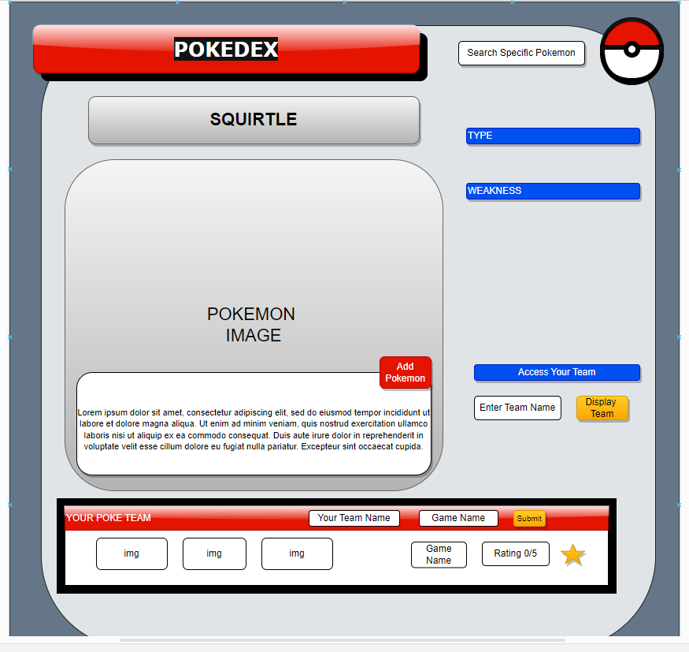

# FlatIron_Poke_Project README

Description: A webapp that allows users to construct a creative and efficient team utilizing an immersive gallery of 1st gen pokemons of their choice, have the pokemon community rank their team's efficiency and be able to freely view information of individual monsters.

Public API: https://pokeapi.co/api/v2/pokemon

API JSON Structure: TOP LEVEL

<!-- {"count":1281,"next":"https://pokeapi.co/api/v2/pokemon?offset=20&limit=20","previous":null,"results":[{"name":"bulbasaur","url":"https://pokeapi.co/api/v2/pokemon/1/"},{"name":"ivysaur","url":"https://pokeapi.co/api/v2/pokemon/2/"},{"name":"venusaur","url":"https://pokeapi.co/api/v2/pokemon/3/"},{"name":"charmander","url":"https://pokeapi.co/api/v2/pokemon/4/"},{"name":"charmeleon","url":"https://pokeapi.co/api/v2/pokemon/5/"},{"name":"charizard","url":"https://pokeapi.co/api/v2/pokemon/6/"},{"name":"squirtle","url":"https://pokeapi.co/api/v2/pokemon/7/"},{"name":"wartortle","url":"https://pokeapi.co/api/v2/pokemon/8/"},{"name":"blastoise","url":"https://pokeapi.co/api/v2/pokemon/9/"},{"name":"caterpie","url":"https://pokeapi.co/api/v2/pokemon/10/"},{"name":"metapod","url":"https://pokeapi.co/api/v2/pokemon/11/"},{"name":"butterfree","url":"https://pokeapi.co/api/v2/pokemon/12/"},{"name":"weedle","url":"https://pokeapi.co/api/v2/pokemon/13/"},{"name":"kakuna","url":"https://pokeapi.co/api/v2/pokemon/14/"},{"name":"beedrill","url":"https://pokeapi.co/api/v2/pokemon/15/"},{"name":"pidgey","url":"https://pokeapi.co/api/v2/pokemon/16/"},{"name":"pidgeotto","url":"https://pokeapi.co/api/v2/pokemon/17/"},{"name":"pidgeot","url":"https://pokeapi.co/api/v2/pokemon/18/"},{"name":"rattata","url":"https://pokeapi.co/api/v2/pokemon/19/"},{"name":"raticate","url":"https://pokeapi.co/api/v2/pokemon/20/"}]} -->

NOTE: We will be extracting pokemon up to number 151 (These are the first generation pokemon to reduce list). We will extract names, types, images, and moves. 

Db.json Structure:

After loading in pokemon from API, user will be able to select pokemon to add to their team and have it rated. Will also be able to pull team hopefully now with a rating. 
 {"teamName": "Eman's Team","pokemon": "[]", "ratings": "[]", "officialRating":"0"}

MVP: User will have the chance to develop an effective team using via a team posting system and community rating system

Stretch Goals: 
Search up Pokemon from API to display with information
Submit teams (groups of 6 pokemon) to site for review
Submit reviews of posted teams
Retrieve previously posted teams

//SERGIO WAS HERE
//TESTING git pull origin main
//adding changes again