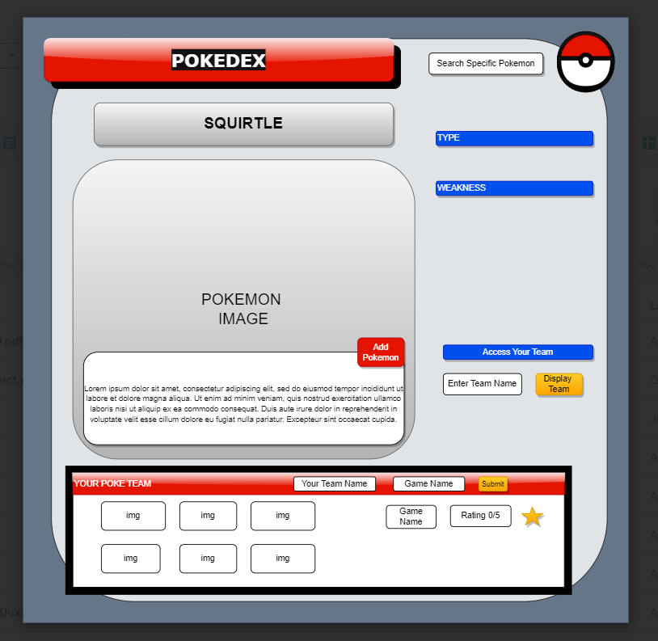
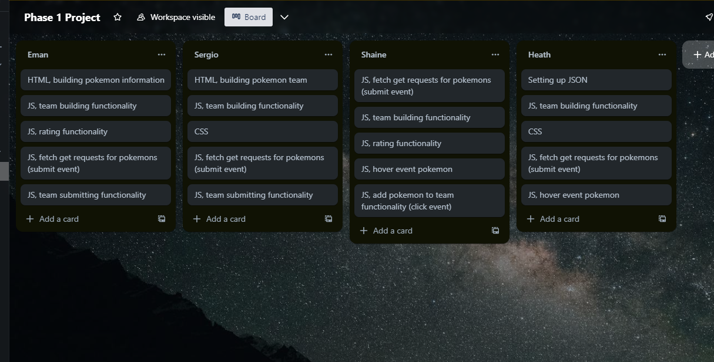

# FlatIron_Poke_Project

## Description
### A webapp that allows users to construct a creative and efficient team utilizing an immersive gallery of 1st gen pokemons of their choice, have the pokemon community rank their team's efficiency and be able to freely view information of individual monsters.

## Project Details

### Public API: https://pokeapi.co/api/v2/pokemon

Our intention is to use this API to gather usable data, however if not enough data is usable we can create our own db.json and manually fill it with the information we need.
This includeds at minimum clear pokemon images, descriptions, and types.  

API JSON Structure TOP LEVEL:

    {"count":1281,"next":"https://pokeapi.co/api/v2/pokemon?offset=20&limit=20","previous":null,"results":[{"name":"bulbasaur","url":"https://pokeapi.co/api/v2/pokemon/1/"},{"name":"ivysaur","url":"https://pokeapi.co/api/v2/pokemon/2/"},{"name":"venusaur","url":"https://pokeapi.co/api/v2/pokemon/3/"},{"name":"charmander","url":"https://pokeapi.co/api/v2/pokemon/4/"},{"name":"charmeleon","url":"https://pokeapi.co/api/v2/pokemon/5/"},{"name":"charizard","url":"https://pokeapi.co/api/v2/pokemon/6/"},{"name":"squirtle","url":"https://pokeapi.co/api/v2/pokemon/7/"},{"name":"wartortle","url":"https://pokeapi.co/api/v2/pokemon/8/"},{"name":"blastoise","url":"https://pokeapi.co/api/v2/pokemon/9/"},{"name":"caterpie","url":"https://pokeapi.co/api/v2/pokemon/10/"},{"name":"metapod","url":"https://pokeapi.co/api/v2/pokemon/11/"},{"name":"butterfree","url":"https://pokeapi.co/api/v2/pokemon/12/"},{"name":"weedle","url":"https://pokeapi.co/api/v2/pokemon/13/"},{"name":"kakuna","url":"https://pokeapi.co/api/v2/pokemon/14/"},{"name":"beedrill","url":"https://pokeapi.co/api/v2/pokemon/15/"},{"name":"pidgey","url":"https://pokeapi.co/api/v2/pokemon/16/"},{"name":"pidgeotto","url":"https://pokeapi.co/api/v2/pokemon/17/"},{"name":"pidgeot","url":"https://pokeapi.co/api/v2/pokemon/18/"},{"name":"rattata","url":"https://pokeapi.co/api/v2/pokemon/19/"},{"name":"raticate","url":"https://pokeapi.co/api/v2/pokemon/20/"}]} 

INTENDED DB.JSON STRUCTURE FOR TEAM STORAGE:

    {"teamName": "Eman's Team","pokemon": "[bulbasaur, pikachu, squirtle, charmander, mew, onix]", "ratings": "[4,4,1,3]", "officialRating":"3"}

- We will be extracting pokemon up to number 151 (These are the first generation pokemon to reduce total pokemon list). We will extract names, types, images, and moves. 
- After loading in pokemon from API, user will be able to select pokemon to add to their team and have it rated. Will also be able to pull team hopefully now with a rating. 

## MVP: 
### User will have the chance to develop an effective team using via a team posting system and community rating system
- User will be able to search up individual Pokemon 
- Users will be able to see information about individual Pokemons
- User will have option to select pokemon for their team and submit the team on our page
- Users will be able to retrieve posted teams and give them reviews

### Stretch Goals: 
- Search up individual pokemon using a form and submit
- Add indivdual pokemon to a team using a click on a button
- Submit teams with with form submit and POST
- Submit reviews with form submit and PATCH
- Retrieve previously posted teams with form submit and GET

### WIREFRAME

### TRELLO

<!-- Bruh -->
<!-- No -->
<!-- Mod -->